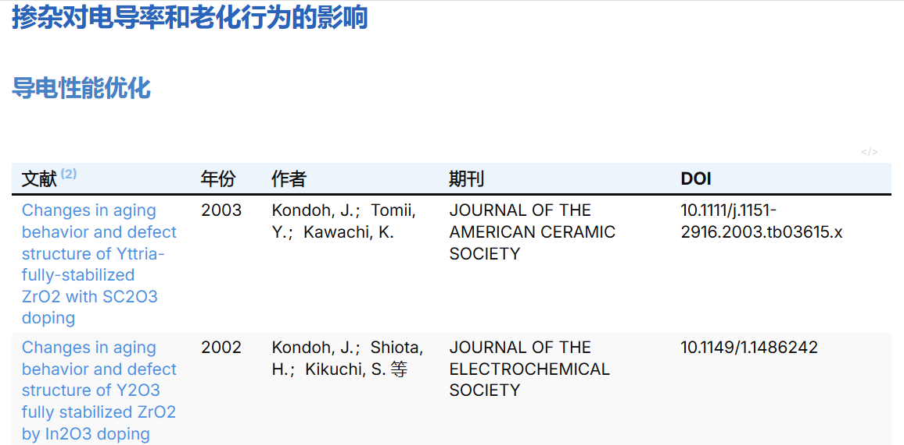
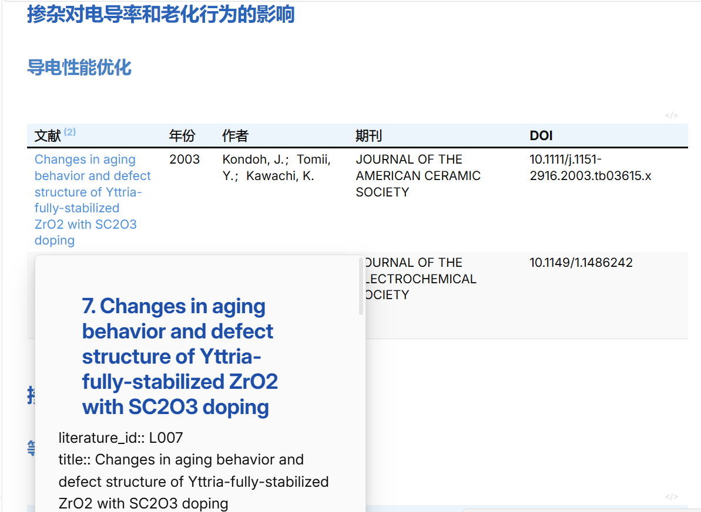

# RIS_literature_review

  

一个用于读取 EndNote、Web of Science、Zotero 等工具导出的 RIS 文献文件，并借助 AI agent 生成文献卡片、分类总结 Markdown 和清洗 Excel 的 Python 项目。

  

## 功能

  

- 读取 `data/raw/` 中的 `.ris` 文件。

- 解析 `title`、`authors`、`year`、`journal`、`doi`、`keywords`、`abstract`。

- 兼容 RIS 摘要字段 `AB` 和 `N2`，也兼容 EndNote `%0/%A/%T/%X` 导出格式。

- 优先按 DOI 去重；无 DOI 时按标题近似去重。

- 调用配置的 AI agent 先根据当前研究主题和整组文献生成分类体系，再逐篇阅读文献并生成结构化整理字段。

- 输出 Excel：`output/excel/literature_records.xlsx`。

- 输出文献卡片：`output/markdown/literature_cards.md`。

- 输出 Obsidian + Dataview 分类总结：`output/markdown/literature_summary.md`。

- 可通过模板文件调整 AI 阅读 prompt、文献卡片格式和总结文件格式。

  

## 项目结构

  

```text

.

├── config/

│   ├── deepseek_v4pro.example.json

│   ├── chatgpt.example.json

│   └── claude.example.json

├── data/

│   └── raw/

├── output/

│   ├── cache/

│   ├── excel/

│   └── markdown/

├── propmts/

│   ├── review_template.md

│   └── summary_template.md

├── src/

│   ├── main.py

│   ├── project_paths.py

│   ├── AI_agent.py

│   ├── AI_group_classification.py

│   ├── RIS_analysis.py

│   ├── remove_duplicates.py

│   ├── read_templete.py

│   ├── AI_cache_annotation.py

│   └── output_module.py

├── .env.example

├── requirements.txt

└── README.md

```

  

## 安装

  

建议使用 Python 3.10+。如果本机没有现成虚拟环境，请在项目根目录创建一个新的 `.venv`，然后安装 `requirements.txt` 中的依赖。

  

Windows / PowerShell：

  

```powershell

python -m venv .venv

.\.venv\Scripts\Activate.ps1

python -m pip install --upgrade pip

pip install -r requirements.txt

```

  

macOS / Linux：

  

```bash

python3 -m venv .venv

source .venv/bin/activate

python -m pip install --upgrade pip

pip install -r requirements.txt

```

  

如果习惯使用 Conda，也可以创建独立环境：

  

```powershell

conda create -n literature_review python=3.11

conda activate literature_review

pip install -r requirements.txt

```

  

目前 `requirements.txt` 中的 `openpyxl` 和 `requests` 就能支持主程序运行：`openpyxl` 用于生成 Excel，`requests` 用于调用 AI API。

  

## 配置 AI Agent

  

默认使用 DeepSeek 配置。复制示例文件后填入自己的 API key：

  

```powershell

Copy-Item config/deepseek_v4pro.example.json config/deepseek_v4pro.json

```

  

`config/deepseek_v4pro.example.json` 已启用高思考配置：

  

```json

{

  "thinking": {

    "type": "enabled"

  },

  "reasoning_effort": "high"

}

```

  

也可以通过环境变量填写 key：

  

```powershell

$env:DEEPSEEK_API_KEY="sk-your-deepseek-api-key"

```

  

### 切换 ChatGPT

  

```powershell

Copy-Item config/chatgpt.example.json config/chatgpt.json

$env:LITERATURE_AGENT="chatgpt"

python src/main.py

```

  

也可以用环境变量：

  

```powershell

$env:OPENAI_API_KEY="sk-your-openai-api-key"

```

  

### 切换 Claude

  

```powershell

Copy-Item config/claude.example.json config/claude.json

$env:LITERATURE_AGENT="claude"

python src/main.py

```

  

也可以用环境变量：

  

```powershell

$env:ANTHROPIC_API_KEY="sk-ant-your-claude-api-key"

```

  

## 使用

  

1. 将 `.ris` 文件放入：

  

```text

data/raw/

```

  

2. 运行主程序：

  

```powershell

python src/main.py

```

  

3. 查看输出：

  

```text

output/excel/literature_records.xlsx

output/markdown/literature_cards.md

output/markdown/literature_summary.md

```

  

如果没有配置 API key，程序仍会运行，但分类会标记为 `AI未分类/待AI分析`，不会再用 Python 关键词规则硬编码分类；配置 API key 后会调用 AI agent 生成文献组分类体系并逐篇阅读文献。

  

## 修改 AI 阅读模板

  

逐篇文献整理模板：

  

```text

propmts/review_template.md

```

  

分类总结模板：

  

```text

propmts/summary_template.md

```

  

`review_template.md` 里有三个主要区域：

  

- `AI_READING_PROMPT`：控制 AI 阅读文献时的角色、研究主题和判断重点。

- `AI_USER_PROMPT`：控制 AI 需要输出除了文献序号、标题、作者、年份、期刊、DOI、关键词和摘要这些固定字段之外的其他结构化字段。

- `CARD_TEMPLATE`：控制 `literature_cards.md` 中每篇文献卡片的 Markdown 样式。

  

程序会先把整组文献交给 AI，根据 `AI_READING_PROMPT` 中的研究主题自动生成 `broad_direction`、`medium_direction`、`small_direction` 等分类体系。后续逐篇文献阅读会优先从这套 AI 生成的分类体系中选择分类。因此更换研究主题时，只需要修改 `AI_READING_PROMPT`中的相关内容，不用进入 Python 文件手动改分类规则。

  

如果只想改变 AI 输出字段，请修改 `AI_USER_PROMPT` 中的字段列表，并在 `CARD_TEMPLATE` 中使用同名 `{{field_name}}` 占位符。程序会自动把这些字段同步到 AI 输出要求、Excel 表头和文献卡片渲染中。

  

修改模板后重新运行即可。若想让已有缓存文献重新调用 AI 阅读：

  

```powershell

$env:LITERATURE_REFRESH_AI="1"

python src/main.py

```

  

文献组分类默认使用 `auto` 模式：小文献组会一次性读取整组文献；当文献数量或 prompt 长度较大时，会自动拆成多批，先生成每批局部分类体系，再合并为全局分类体系，避免 100-200 篇文献一次性塞入模型导致上下文爆掉。默认组分类使用 `6000` output tokens；也可以通过环境变量调整：

  

```powershell

$env:LITERATURE_GROUP_MAX_TOKENS="8000"

python src/main.py

```

  

大文献组相关参数：

  

```powershell

# auto：自动判断；single：强制一次性整组分类；batch：强制分批分类

$env:LITERATURE_GROUP_MODE="auto"

  

# 每批最多多少篇文献

$env:LITERATURE_GROUP_BATCH_SIZE="25"

  

# 每批 prompt 的大致字符预算

$env:LITERATURE_GROUP_MAX_INPUT_CHARS="60000"

  

# 大文献组局部分类时，每篇摘要最多放入多少字符

$env:LITERATURE_GROUP_RECORD_ABSTRACT_CHARS="300"

  

# 合并全局分类体系时建议保留的最大分类数量

$env:LITERATURE_GROUP_MAX_TAXONOMY_ITEMS="40"

  

# 每轮最多合并多少个局部分类体系

$env:LITERATURE_GROUP_MERGE_SIZE="8"

# 严格 JSON 分类任务默认不启用 thinking，避免模型把 output token 全用在推理上而不返回 JSON

$env:LITERATURE_GROUP_USE_THINKING="0"

```

  

如果模型没有返回合法 JSON，程序会自动重试一次严格 JSON 输出，并把最近一次原始响应保存到 `output/cache/literature_group_classification_last_response.json`，便于排查 prompt 或模型返回格式问题。

  

## obsidian + dataview

obsidain + dataview插件，可以以表格形式呈现分类结果 ，例如：
同时可以同步看文献卡片

  

## 缓存说明

  

AI 阅读结果会缓存到：

  

```text

output/cache/literature_ai_annotations.json

```

  

文献组分类体系会缓存到：

  

```text

output/cache/literature_group_classification.json

```

  

缓存可以减少重复调用 API。缓存签名包含 `review_templete.md`、`sunmary_templete.md` 的关键内容、当前文献组信息以及大文献组分批参数；修改研究主题、字段、分类要求、文献组或分批参数后，新的模板会生成新的缓存记录。大文献组模式下，每个 batch 的局部分类也会写入同一个缓存文件，方便断点续跑。
